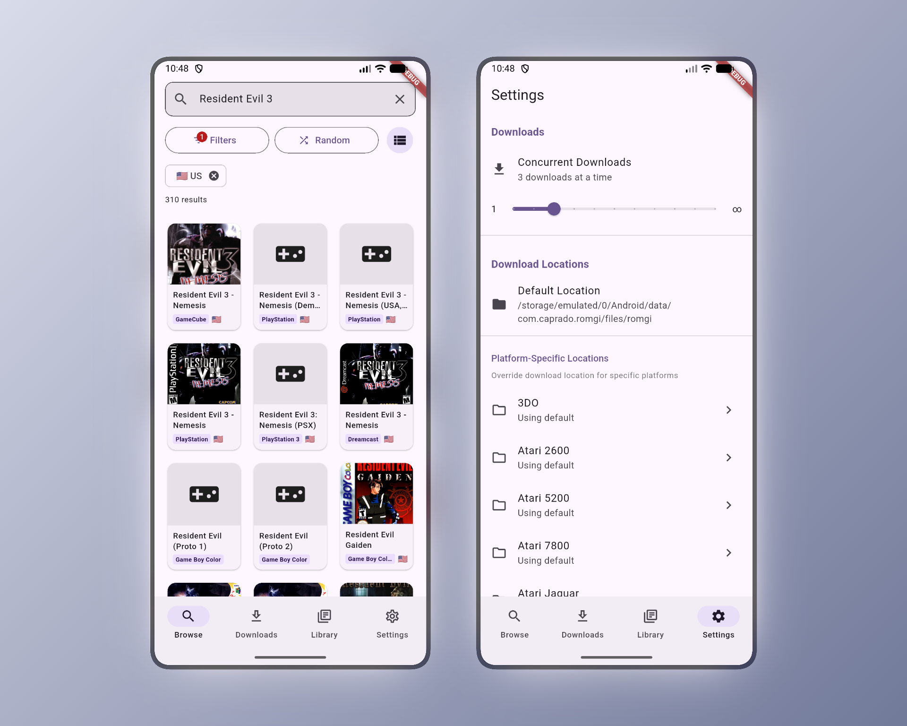

# romgi

**Easy-to-use ROM downloader for Android devices**

<p align="center">
  
</p>

A standalone Android application for browsing, downloading, and managing ROMs on Android devices. Perfect for emulation handhelds like Retroid Pocket, Anbernic, AYN Odin, and more.

Concept inspired by [pkgi-psp](https://github.com/bucanero/pkgi-psp), [Kekatsu-DS](https://github.com/cavv-dev/Kekatsu-DS), and similar tools.

## Features

- **Browse & Search** - Search through thousands of ROMs across multiple platforms
- **Platform Filtering** - Filter by Nintendo, Sony, Sega, and many more
- **Region Filtering** - Find ROMs by region (US, EU, JP, etc.)
- **Box Art Display** - Visual browsing with cached cover art thumbnails
- **Download Queue** - Queue multiple downloads with concurrent download support
- **Background Downloads** - Downloads continue even when the app is in the background
- **Pause & Resume** - Pause downloads and resume them anytime, even after app restart
- **ZIP Extraction** - Automatic extraction of downloaded archives
- **Library Management** - Track all your downloaded ROMs in one place
- **Platform Organization** - Downloads automatically organized into platform folders
- **Custom Download Paths** - Set default or per-platform download locations
- **Internet Archive Support** - Login support for protected Internet Archive downloads

## Quick Setup

1. Download the latest APK from the [Releases](https://github.com/caprado/romgi/releases) page.

2. Install the APK on your Android device.

   - You may need to enable "Install from unknown sources" in your device settings.

3. Launch romgi and grant storage permissions when prompted.

4. Start browsing! Use the search bar and filters to find ROMs.

5. Tap on any ROM to view details and available download links.

6. Tap "Download" to add to your queue. Downloads will start automatically.

## Navigation

romgi uses a bottom navigation bar with four main sections:

| Tab           | Description                                    |
| ------------- | ---------------------------------------------- |
| **Browse**    | Search and filter ROMs from the database       |
| **Downloads** | View active, queued, and completed downloads   |
| **Library**   | Browse your downloaded ROM collection          |
| **Settings**  | Configure download paths, themes, and accounts |

## Download Locations

By default, romgi saves downloads to a public folder accessible by any file manager and emulator:

```
/storage/emulated/0/Download/Roms/
├── snes/
├── n64/
├── psx/
└── ...
```

On first launch, you'll be prompted to grant storage permission ("Allow access to manage all files") to enable saving to this location.

You can customize this in **Settings > Download Locations**:

- Set a custom default download path
- Override paths for specific platforms (e.g., save PS1 games to a different SD card folder)

## Internet Archive Login

Some ROMs hosted on Internet Archive require authentication. To access these:

1. Go to **Settings > Accounts > Internet Archive**
2. Enter your Internet Archive credentials
3. Protected downloads will now work automatically

Links requiring login are marked with a purple "Login Required" badge.

## Supported Platforms

romgi supports a wide range of retro gaming platforms, including:

- **Nintendo**: NES, SNES, N64, GameCube, Wii, Game Boy, GBA, DS, 3DS, and more
- **Sony**: PlayStation, PS2, PSP, PS Vita
- **Sega**: Master System, Genesis/Mega Drive, Saturn, Dreamcast, Game Gear
- **And many more**: Atari, Neo Geo, TurboGrafx, and other retro platforms

## Building from Source

### Requirements

- [Flutter SDK](https://flutter.dev/docs/get-started/install) (3.0 or higher)
- Android SDK with API level 24+ (Android 7.0+)
- Git

### Build Instructions

```bash
# Clone the repository
git clone https://github.com/caprado/romgi.git
cd romgi

# Get dependencies
flutter pub get

# Build debug APK
flutter build apk --debug

# Build release APK
flutter build apk --release
```

The built APK will be located at `build/app/outputs/flutter-apk/app-release.apk`.

## Technical Details

- **Minimum Android Version**: Android 7.0 (API 24)
- **Target Android Version**: Latest stable
- **Framework**: Flutter/Dart
- **Data Source**: Built-in ROM Database

### Key Dependencies

| Package                       | Purpose                            |
| ----------------------------- | ---------------------------------- |
| `dio`                         | HTTP client with download progress |
| `sqflite`                     | Local SQLite database              |
| `flutter_riverpod`            | State management                   |
| `cached_network_image`        | Box art caching                    |
| `archive`                     | ZIP extraction                     |
| `flutter_local_notifications` | Download notifications             |
| `flutter_foreground_task`     | Background downloads               |

## Disclaimer

romgi is a tool for downloading content; it does not host any ROMs or copyrighted material. Users are responsible for ensuring they have the legal right to download any content. Similar to how torrent clients operate, the application itself is neutral regarding the content being downloaded.

## Credits

- **Data Sources**: Myrient, Internet Archive, NoPayStation, MarioCube
- **Inspiration**: [pkgi-psp](https://github.com/bucanero/pkgi-psp), [Kekatsu-DS](https://github.com/cavv-dev/Kekatsu-DS)
- **Framework**: [Flutter](https://flutter.dev/)

## License

This project is open source. See the [LICENSE](LICENSE) file for details.
