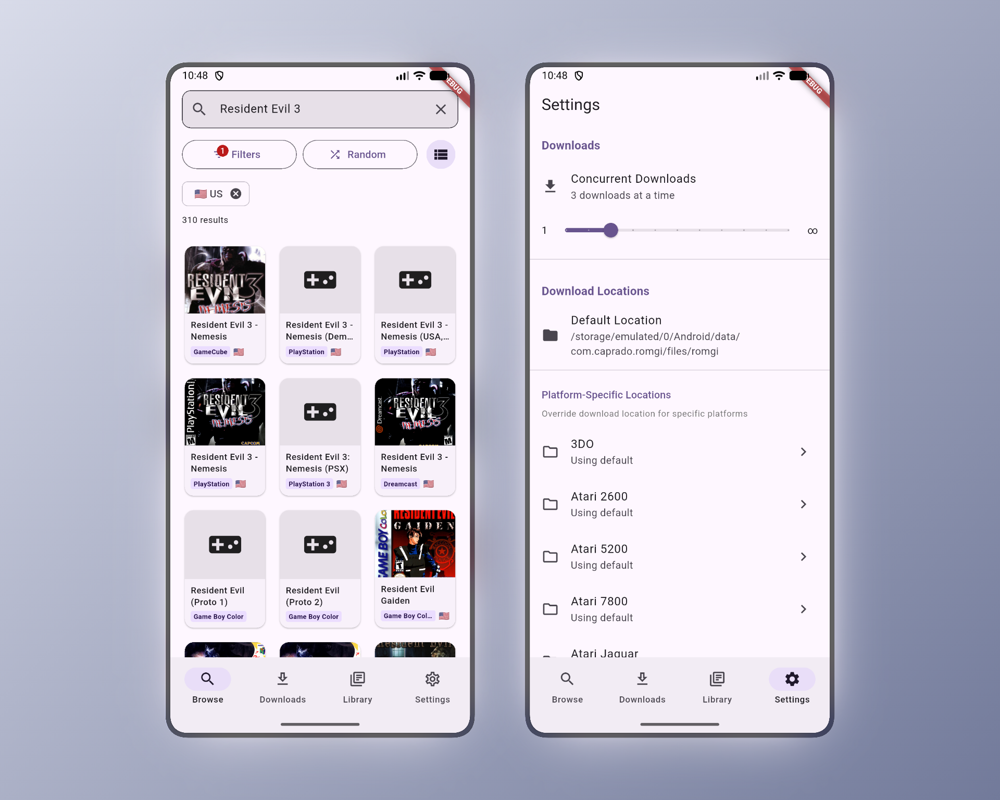

# romgi

**Easy-to-use ROM downloader for Android devices**

<p align="center">
  
</p>

A standalone Android application for browsing, downloading, and managing ROMs on Android devices. Perfect for emulation handhelds like Retroid Pocket, Anbernic, AYN Odin, and more.

Concept inspired by [pkgi-psp](https://github.com/bucanero/pkgi-psp), [Kekatsu-DS](https://github.com/cavv-dev/Kekatsu-DS), and similar tools.

## Features

- **Browse & Search** - Search through thousands of ROMs across multiple platforms
- **Platform & Region Filtering** - Filter by brand, platform, and region (US, EU, JP, ...)
- **Box Art Display** - Visual browsing with cached cover art thumbnails
- **Download Queue** - Queue multiple downloads with concurrent download support
- **HTTP + Torrent transports** - Direct HTTP downloads and BitTorrent (selective per-file) in the same queue
- **Background Downloads** - Downloads continue when the app is in the background
- **Pause & Resume** - Resume downloads after app restart, including torrents
- **Archive Extraction** - Automatic extraction of downloaded ZIP and 7z archives, configurable per-platform
- **Library Management** - Track all your downloaded ROMs in one place
- **Custom Download Paths** - Set default or per-platform download locations
- **Internet Archive Support** - Persistent login for protected Internet Archive items
- **Source Status** - See per-catalog health (online / down / unknown) in Settings

## Quick Setup

1. Download the latest APK from the [Releases](https://github.com/caprado/romgi/releases) page.

2. Install the APK on your Android device.
   - You may need to enable "Install from unknown sources" in your device settings.

3. Launch romgi and grant storage permissions when prompted.

4. Start browsing! Use the search bar and filters to find ROMs.

5. Tap on any ROM to view details and available download links.

6. Tap "Download" to add to your queue. Downloads will start automatically.

## Navigation

romgi uses a bottom navigation bar with four main sections:

| Tab           | Description                                    |
| ------------- | ---------------------------------------------- |
| **Browse**    | Search and filter ROMs from the database       |
| **Downloads** | View active, queued, and completed downloads   |
| **Library**   | Browse your downloaded ROM collection          |
| **Settings**  | Configure download paths, themes, and accounts |

## Download Locations

By default, romgi saves downloads to a public folder accessible by any file manager and emulator:

```
/storage/emulated/0/Download/Roms/
├── snes/
├── n64/
├── psx/
└── ...
```

On first launch, you'll be prompted to grant storage permission ("Allow access to manage all files") to enable saving to this location.

You can customize this in **Settings > Download Locations**:

- Set a custom default download path
- Override paths for specific platforms (e.g., save PS1 games to a different SD card folder)

## Internet Archive Login

Some ROMs hosted on Internet Archive require authentication. To access them:

1. Go to **Settings > Accounts > Internet Archive > Log in**.
2. Sign in to archive.org in the embedded browser.
3. romgi captures the session and exchanges it for a long-lived API key — protected downloads work automatically from then on.

The session is stored encrypted on the device and persists across app restarts. romgi re-validates it in the background; if the key is ever revoked, you'll be prompted to log in again. Links requiring login are marked with a "Login Required" badge.

## Torrent Sources

Some catalogs (notably MiNERVA) distribute ROMs as BitTorrent torrents — often as multi-ROM packs containing thousands of files. romgi handles these natively:

- The download queue treats torrent links the same as HTTP links — pick a ROM, tap **Download**.
- Only the file you ask for is downloaded from the torrent (selective download via libtorrent file priorities). You don't grab the whole pack.
- romgi does not seed. Once your file is downloaded, the torrent is removed and no upload occurs.
- Torrents can be disabled entirely in **Settings > Downloads > Disable Torrents** if you prefer direct downloads only.

## Supported Platforms

romgi supports a wide range of retro gaming platforms, including:

- **Nintendo**: NES, SNES, N64, GameCube, Wii, Game Boy, GBA, DS, 3DS, and more
- **Sony**: PlayStation, PS2, PSP, PS Vita
- **Sega**: Master System, Genesis/Mega Drive, Saturn, Dreamcast, Game Gear
- **And many more**: Atari, Neo Geo, TurboGrafx, and other retro platforms

## Building from Source

### Requirements

- [Flutter SDK](https://flutter.dev/docs/get-started/install) (3.10 or higher)
- Android SDK with API level 24+ (Android 7.0+)
- Git

### Build the app

```bash
git clone https://github.com/caprado/romgi.git
cd romgi
flutter pub get

flutter build apk --debug      # debug APK
flutter build apk --release    # release APK (arm64 only)
```

The built APK will be located at `build/app/outputs/flutter-apk/app-release.apk`.

Release builds are filtered to **arm64-v8a** to keep the APK size sane after bundling the BitTorrent runtime. Every modern Android phone and retro handheld is arm64. To produce a 4-ABI build, edit `abiFilters` in `android/app/build.gradle.kts`.

### The catalog database

The app pulls a pre-built SQLite catalog from this repo, updated weekly. `db/CATALOG.md` documents the artifact format. The catalog is provided for use in romgi; forks and derivative tools are not supported.

## Technical Details

- **Minimum Android Version**: Android 7.0 (API 24)
- **Target Android Version**: Latest stable
- **Framework**: Flutter/Dart
- **Data Source**: Built-in ROM Database

### Key Dependencies

| Package                       | Purpose                                 |
| ----------------------------- | --------------------------------------- |
| `dio`                         | HTTP client with download progress      |
| `sqflite`                     | Local SQLite (downloads, library)       |
| `flutter_riverpod`            | State management                        |
| `cached_network_image`        | Box art caching                         |
| `commons-compress` (Android)  | ZIP and 7z extraction via Pigeon bridge |
| `flutter_local_notifications` | Download notifications                  |
| `flutter_foreground_task`     | Background HTTP + torrent downloads     |
| `flutter_secure_storage`      | Encrypted IA session storage            |
| `webview_flutter`             | IA login flow                           |
| `pigeon`                      | Type-safe Dart ↔ Kotlin bridge (torrent + extraction) |
| `libtorrent4j` (Android)      | BitTorrent runtime with file priorities |

## Disclaimer

romgi is a tool for downloading content; it does not host any ROMs or copyrighted material. Users are responsible for ensuring they have the legal right to download any content. Similar to how torrent clients operate, the application itself is neutral regarding the content being downloaded.

## Credits

- **Data Sources**: MiNERVA Archive, Internet Archive, NoPayStation, MarioCube
- **Inspiration**: [pkgi-psp](https://github.com/bucanero/pkgi-psp), [Kekatsu-DS](https://github.com/cavv-dev/Kekatsu-DS)
- **Framework**: [Flutter](https://flutter.dev/)

## License

This project is open source. See the [LICENSE](LICENSE) file for details.
